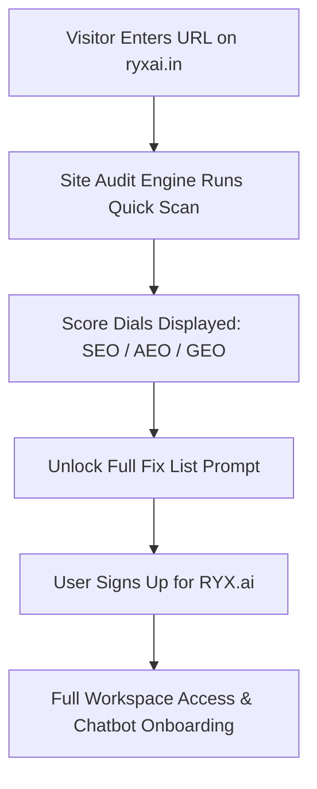

# RYX.ai Site Audit Agent (SEO · AEO · GEO) Implementation Plan

> **Source Reference**: RYX.ai Platform Expansion Opportunities Report (September 2026)  
> **Prepared for**: RYX.ai Engineering & Product Team  
> **Status**: Architecture & Implementation Specification  

---

## 1. Executive Summary & Vision

### What is the Site Audit Agent?
The **Site Audit Agent** is an automated auditing engine built into RYX.ai that evaluates a tenant's website across **three discoverability layers**:
1. **SEO (Search Engine Optimisation)**: Can traditional search engines (Google, Bing) crawl, index, and rank the site?
2. **AEO (Answer Engine Optimisation)**: Is the content structured so search engines can lift direct answers into featured snippets, voice assistants (Siri, Alexa), and Google AI Overviews?
3. **GEO (Generative Engine Optimisation)**: Can generative AI models (ChatGPT, Perplexity, Claude, Gemini) find, read, trust, and cite the brand when prospective buyers ask purchasing questions?

### Why This Matters for RYX.ai
Because the RYX.ai chatbot widget is already embedded on the tenant's website, the system already knows the tenant's domain. The Site Audit Agent transforms this from a passive chatbot embed into an **active discoverability & lead-generation driver**:
- **Internal Value**: Tenants use the audit inside their workspace to diagnose why they aren't ranking or getting mentioned by AI tools.
- **External Lead Magnet**: An ungated scan on the public `ryxai.in` homepage lets prospective customers input their URL, see their score dials, and register for RYX.ai to unlock the actionable fix checklist.



---

## 2. The 3-Layer Scoring Model Explained Simply

The overall site score is an aggregated score (0–100) calculated from four weighted categories:

```
Total Health Score = (Technical SEO × 0.25) + (On-Page & Authority × 0.20) + (AEO × 0.25) + (GEO × 0.30)
```

| Layer | Weight | What It Means (Simple Explanation) | Example Key Metrics |
| :--- | :---: | :--- | :--- |
| **1. SEO — Technical** | **25%** | **The Foundation**: Can robots enter, read, and navigate the website without crashing, hitting dead ends, or getting blocked? | Robots.txt, Sitemap, HTTPS, Broken links, Core Web Vitals, Mobile readiness |
| **2. SEO — On-Page & Authority** | **20%** | **The Content & Trust**: Is the content clear and well-written, and do other trusted websites vouch for this business? | Title tags, Meta descriptions, H1 hierarchy, Image alt tags, Backlinks, Google Business Profile |
| **3. AEO (Answer Engine Optimisation)** | **25%** | **Direct Answers**: If someone asks Siri, Google, or an AI a question, is the answer written in a concise, quote-ready format? | Schema.org markup, Question headings, 40–60 word answer-first paragraphs, FAQ blocks |
| **4. GEO (Generative Engine Optimisation)** | **30%** | **AI Citations**: When ChatGPT or Perplexity builds a recommendation, does it know who this brand is and trust it enough to cite it? | AI crawler access (`GPTBot`, `ClaudeBot`), `llms.txt`, Entity `sameAs` links, Section chunkability, Third-party reviews |

---

## 3. Complete Inventory of All 43 Checks

Each check returns three data points:
1. **Status**: `Pass` (Green), `Warning` (Amber), or `Error` (Red).
2. **Evidence**: The exact tag, text snippet, or HTTP header found on the page.
3. **Fix Recommendation**: A plain-English instruction telling the user exactly how to resolve the issue.

---

### Layer 1: Technical SEO Checks (10 Items · 25% Weight)

| # | Check Name | Simple Explanation | What Passes vs What Fails |
|---|------------|--------------------|---------------------------|
| **1** | **robots.txt Validity** | Checks if the crawl rule file exists and isn't blocking search engines. | **Pass**: File exists, valid syntax. <br>**Fail**: File missing or disallows `/` to all bots. |
| **2** | **Sitemap Present & Linked** | Checks if an XML sitemap is present and declared in `robots.txt`. | **Pass**: Valid XML sitemap referenced. <br>**Fail**: No sitemap found. |
| **3** | **HTTPS & Redirects** | Ensures the site is secure and `http://` redirects cleanly to `https://`. | **Pass**: Enforced HTTPS with 301 redirects. <br>**Fail**: Mixed content or insecure HTTP accessible. |
| **4** | **Canonical Tags** | Tells search engines which URL is the master copy to avoid duplicate penalties. | **Pass**: Valid self-referential or target canonical tag. <br>**Fail**: Missing or points to 404. |
| **5** | **4xx / 5xx Dead Links & Redirect Chains** | Finds broken links that frustrate visitors and waste crawl budget. | **Pass**: All internal links return HTTP 200. <br>**Fail**: Dead 404 links or redirect loops (>2 hops). |
| **6** | **Accidental Noindex** | Checks if a page was accidentally told not to appear in Google search results. | **Pass**: Indexable. <br>**Fail**: `<meta name="robots" content="noindex">` on key public pages. |
| **7** | **Mobile Viewport** | Verifies the site configures a responsive viewport tag for phone screens. | **Pass**: `<meta name="viewport" content="width=device-width, initial-scale=1">`. <br>**Fail**: Missing tag. |
| **8** | **Page Weight & Asset Size** | Flags bloated pages that load slowly on mobile networks. | **Pass**: Total page transfer under 2.5 MB. <br>**Fail**: Bloated page > 5 MB. |
| **9** | **Core Web Vitals (LCP/CLS/INP)** | Google's speed and layout stability metric. | **Pass**: LCP < 2.5s, CLS < 0.1. <br>**Fail**: LCP > 4.0s or unstable shifting layout. |
| **10** | **hreflang Tags** | For multi-language sites, ensures proper language/region targeting. | **Pass**: Valid ISO language codes with return tags. <br>**Fail**: Broken cross-language links. |

---

### Layer 2: On-Page & Authority SEO Checks (13 Items · 20% Weight)

| # | Check Name | Simple Explanation | What Passes vs What Fails |
|---|------------|--------------------|---------------------------|
| **11** | **Title Tag Length & Uniqueness** | The headline shown on Google's search results page. | **Pass**: 40–60 characters, descriptive. <br>**Fail**: Missing, < 20 chars, or > 70 chars. |
| **12** | **Meta Description Quality** | The summary paragraph shown under the Google search link. | **Pass**: 120–160 characters with clear call-to-action. <br>**Fail**: Missing or truncated (>165 chars). |
| **13** | **Heading Hierarchy** | Checks for exactly one `<h1>` tag and structured `<h2>`/`<h3>` flow. | **Pass**: Exactly 1 H1 tag followed by logical H2s. <br>**Fail**: Zero H1 tags or multiple competing H1s. |
| **14** | **Thin Content Detection** | Flags pages with almost no text that search engines consider low-value. | **Pass**: > 300 words of meaningful copy. <br>**Fail**: Under 150 words of body text. |
| **15** | **Keyword Placement** | Confirms primary topic keywords appear in the title, first paragraph, and H2. | **Pass**: Natural keyword placement in key positions. <br>**Fail**: No topic keyword in intro. |
| **16** | **Image Alt-Text Coverage** | Text descriptions for images needed for visually impaired users and image search. | **Pass**: 100% of informational images have `alt="..."`. <br>**Fail**: Images missing alt text. |
| **17** | **Internal Link Health** | Ensures important pages are linked from elsewhere on the site. | **Pass**: Clean internal link graph, no orphan pages. <br>**Fail**: Orphan pages with 0 internal links. |
| **18** | **URL Hygiene** | Clean, lowercase, human-readable URLs without messy parameters. | **Pass**: `/pricing` or `/services/ai-bot`. <br>**Fail**: `/?p=123&session=abc&ref=xyz`. |
| **19** | **Duplicate Titles & Content** | Flags two distinct URLs displaying the exact same title tag. | **Pass**: Every crawled page has a unique title. <br>**Fail**: Multiple pages share the same title. |
| **20** | **Open Graph & Twitter Cards** | Controls thumbnail, title, and description when shared on WhatsApp, LinkedIn, X. | **Pass**: `og:title`, `og:image`, `og:description` present. <br>**Fail**: Missing OG image or title. |
| **21** | **Domain Authority** | Benchmark score indicating overall search trust. | **Pass**: Authority score > 35. <br>**Warn**: Authority score < 20. |
| **22** | **Backlink Profile** | Number of external websites linking to this business. | **Pass**: Active backlinks from reputable domains. <br>**Warn**: Zero external backlinks. |
| **23** | **Referring Domains** | Number of unique websites pointing to this site (diversity of trust). | **Pass**: Diverse referring domains. <br>**Warn**: Low domain diversity. |
| **24** | **Google Business Profile** | Confirms local Google Maps / Business Profile listing is verified. | **Pass**: Verified profile linked. <br>**Fail**: Missing local listing. |

---

### Layer 3: AEO — Answer Engine Optimisation (10 Items · 25% Weight)

AEO focuses on whether search engines and AI assistants can extract a concise answer directly without requiring the user to click through.

| # | Check Name | Simple Explanation | What Passes vs What Fails |
|---|------------|--------------------|---------------------------|
| **25** | **Schema.org Structured Data** | Invisible machine-readable code labeling your business, products, and FAQs. | **Pass**: Valid JSON-LD schema (Organization, Product, Article). <br>**Fail**: Missing or invalid syntax. |
| **26** | **Question-Phrased Headings** | Headings formatted as questions people actually ask (e.g., *"How much does X cost?"*). | **Pass**: Key headings use question formats (`Why`, `How`, `What`). <br>**Warn**: Generic headings (*"Features"*). |
| **27** | **Answer-First Paragraphs (40–60 words)** | A direct, crisp answer right below a question heading before elaborating. | **Pass**: 40–60 word concise answer directly following an H2 question. <br>**Fail**: Fluff or buried answer. |
| **28** | **Visible FAQ Matching Schema** | Verifies that visible FAQ questions exactly match the JSON-LD FAQPage schema. | **Pass**: 100% text match between visible HTML and schema. <br>**Fail**: Schema contains text not visible. |
| **29** | **Lists & Comparison Tables** | AI assistants prefer bulleted lists and tables for quick answer extraction. | **Pass**: Structured `<ul>`/`<ol>` or `<table>` for comparison. <br>**Fail**: Long unstructured text walls. |
| **30** | **Definition Blocks ("X is...")** | Explicit definition sentences that Google can pull for *"What is X?"* snippets. | **Pass**: Clear `"[Product] is a..."` sentence early on page. <br>**Fail**: Ambiguous jargon. |
| **31** | **Speakable Schema** | Explicitly marks which sentences voice assistants should read out loud. | **Pass**: `SpeakableSpecification` schema configured. <br>**Warn**: Missing speakable markup. |
| **32** | **NAP Consistency** | Name, Address, and Phone number match identically everywhere on the web. | **Pass**: Exact NAP match on footer, contact page, and schema. <br>**Fail**: Mismatched phone or address. |
| **33** | **Readability Score** | Measures reading ease; avoids overly dense academic jargon. | **Pass**: Flesch Reading Ease score 60–80 (Grade 7–9). <br>**Fail**: Score < 40 (too complex). |
| **34** | **Content Freshness (`dateModified`)** | Signals to AI engines when the information was last reviewed and updated. | **Pass**: `dateModified` meta tag present and < 6 months old. <br>**Warn**: Modified > 1 year ago. |

---

### Layer 4: GEO — Generative Engine Optimisation (9 Items · 30% Weight)

GEO ensures that when someone asks ChatGPT, Perplexity, Claude, or Gemini for solutions in your industry, the AI models have accessed your site, understand your product, and recommend you.

| # | Check Name | Simple Explanation | What Passes vs What Fails |
|---|------------|--------------------|---------------------------|
| **35** | **AI Crawler Access** | Confirms `robots.txt` does not accidentally block AI search crawlers. | **Pass**: `GPTBot`, `ClaudeBot`, `PerplexityBot`, `Google-Extended`, and `CCBot` are allowed. <br>**Fail**: AI crawlers explicitly blocked. |
| **36** | **`llms.txt` Presence** | A modern standard markdown file located at `/llms.txt` that teaches AI models about your website. | **Pass**: Clean `/llms.txt` file present at website root. <br>**Warn**: Missing `/llms.txt`. |
| **37** | **Author & Expertise Signals (E-E-A-T)** | Identifies who wrote the content, their credentials, and why they are trustworthy. | **Pass**: Author bio, job title, and linked author schema. <br>**Fail**: Anonymous content. |
| **38** | **Entity Links (`sameAs`)** | Links the business entity to recognized authorities (Wikipedia, Wikidata, LinkedIn). | **Pass**: Schema `sameAs` array links to verified company profiles. <br>**Fail**: No entity linkage. |
| **39** | **Section Self-Containment ("Chunkability")** | Checks if individual sections make complete sense when parsed as standalone chunks by RAG engines. | **Pass**: H2 sections contain subject, verb, context, and conclusion. <br>**Fail**: Fragmented sections. |
| **40** | **Server-Rendered vs. Client JS Text** | Checks if text is visible in raw HTML, or if it requires heavy JavaScript execution. | **Pass**: Core text present in raw HTML response. <br>**Fail**: Page is empty `<div>` requiring client-side JS rendering. |
| **41** | **Comparison & Alternatives Content** | Having *"How we compare to [Competitor]"* pages that AI tools directly cite when asked for comparisons. | **Pass**: Clear comparison tables and feature matrices. <br>**Warn**: No comparison data. |
| **42** | **Third-Party Review Presence** | Mentions on trusted review aggregators (G2, Capterra, Reddit, YouTube) that LLMs train on. | **Pass**: Active profile mentions on G2/Reddit/LinkedIn. <br>**Warn**: Zero footprint outside own domain. |
| **43** | **TL;DR Executive Summary Blocks** | Short 2–3 sentence executive summaries at the top of long articles that AI models love to quote. | **Pass**: Dedicated summary block at top of long pages. <br>**Warn**: Long text without summary. |

---

## 4. The AI Visibility Test (The Direct Measure)

Instead of only checking code tags, the **AI Visibility Test** directly probes generative engines to measure actual **Share of Voice (SoV)**.

### How It Works:
1. The tenant enters 3–5 **buyer-intent prompts** (e.g., *"What is the best AI customer support software in India?"* or *"Top alternative to Intercom for SMBs"*).
2. The RYX backend sends these prompts through official APIs to:
   - **OpenAI (ChatGPT)**
   - **Perplexity AI**
   - **Google Gemini**
3. The responses are analyzed for:
   - **Mentioned?**: Is the tenant's brand name in the generated answer? (`Yes / No`)
   - **Ranking / Position**: Is the brand recommended 1st, 2nd, 3rd, or as an afterthought?
   - **Sentiment**: Is the recommendation positive, neutral, or accompanied by caveats?
   - **Competitors Mentioned**: Which rivals appeared alongside or ahead of the tenant?

```
┌────────────────────────────────────────────────────────────────────────┐
│                        AI VISIBILITY SCORECARD                         │
├────────────────────────────────────────────────────────────────────────┤
│  Prompt: "Best AI sales bot for real estate agencies"                  │
│                                                                        │
│  🤖 ChatGPT:    ✅ Mentioned (#2 recommendation) · Positive sentiment  │
│  🔮 Perplexity: ❌ Not cited · Competitors: Hubspot, Drift, Zoko       │
│  ✨ Gemini:     ✅ Mentioned (#1 recommendation) · Positive sentiment  │
│                                                                        │
│  Overall AI Share of Voice: 66% (2 of 3 engines recommended you)       │
└────────────────────────────────────────────────────────────────────────┘
```

---

## 5. Technical Architecture & Implementation Details

### Current Implementation State in Frontend
- **Main Hub**: [`app/workspace/seo/page.tsx`](file:///c:/Users/HP/Desktop/intent-bot-frontend/app/workspace/seo/page.tsx) provides a 3-tab layout:
  1. `🔬 Full-Site Audit (Crawler)` (Default)
  2. `📄 Single-Page Quick Scan`
  3. `📊 Traffic & Conversions`
- **Multi-Page Suite**: [`FullSiteAuditTab.tsx`](file:///c:/Users/HP/Desktop/intent-bot-frontend/app/workspace/seo/_components/FullSiteAuditTab.tsx) includes crawl controls, radial score dials with visible tracks in light/dark mode, CSV export, permalinks, and page-by-page findings drawer.
- **Permalink Reports**: [`app/workspace/seo/site-audit/[id]/page.tsx`](file:///c:/Users/HP/Desktop/intent-bot-frontend/app/workspace/seo/site-audit/%5Bid%5D/page.tsx) renders dedicated per-audit reports.

### Target Backend Engine Architecture
To fulfill the 43-item checklist, the backend crawler operates via the following stack:

```
[Client / Workspace / Public Lead Magnet]
                     │
                     ▼
          [POST /api/audit/start]
                     │
                     ▼
        [Celery / Redis Background Worker]
                     │
       ┌─────────────┴─────────────┐
       ▼                           ▼
[HTTPX Async Fetcher]     [Playwright (Optional DOM)]
 (Fast multi-page crawl)   (JS rendering check)
       │                           │
       └─────────────┬─────────────┘
                     ▼
       [HTML Parsing & Extractors]
       ├── selectolax / BeautifulSoup (DOM structure)
       ├── extruct (JSON-LD & Microdata extraction)
       └── textstat (Flesch-Kincaid readability)
                     │
                     ▼
       [Scoring Engine (43 Rules)]
       ├── Technical SEO (10 rules)
       ├── On-Page & Authority (13 rules)
       ├── AEO (10 rules)
       └── GEO (9 rules)
                     │
                     ▼
       [PostgreSQL: SiteAudit Table]
       ├── tenant_id / website_id
       ├── scores (Overall, Tech, OnPage, AEO, GEO)
       ├── pages (crawled URLs with HTTP status)
       └── findings (pass/warn/fail with line evidence)
```

### Database Schema Design (`SiteAudit` Model)

```python
class SiteAudit(Base):
    __tablename__ = "site_audits"

    id = Column(Integer, primary_key=True)
    tenant_id = Column(Integer, ForeignKey("tenants.id"), nullable=False)
    website_id = Column(Integer, ForeignKey("websites.id"), nullable=False)
    status = Column(String, default="pending")  # pending, running, completed, failed
    
    # Crawl Metrics
    pages_crawled = Column(Integer, default=0)
    pages_failed = Column(Integer, default=0)
    
    # Core Layer Scores (0 - 100)
    avg_overall_score = Column(Float, nullable=True)
    avg_technical_score = Column(Float, nullable=True)
    avg_onpage_score = Column(Float, nullable=True)
    avg_aeo_score = Column(Float, nullable=True)
    avg_geo_score = Column(Float, nullable=True)
    
    # Aggregated Issue Counters
    total_errors = Column(Integer, default=0)
    total_warnings = Column(Integer, default=0)
    total_passed = Column(Integer, default=0)
    
    # Detailed JSON Payloads
    findings_summary = Column(JSON, default=dict)   # Grouped checklist across pages
    ai_visibility_results = Column(JSON, nullable=True)  # Results of LLM queries
    error_message = Column(Text, nullable=True)
    
    started_at = Column(DateTime(timezone=True), nullable=True)
    completed_at = Column(DateTime(timezone=True), nullable=True)
    created_at = Column(DateTime(timezone=True), server_default=func.now())
```

---

## 6. Phased Rollout Roadmap

### Phase 1: Site Audit v1 (Immediate Milestone - Completed)
- [x] Consolidate redundant frontend audit routes into unified `/workspace/seo` hub.
- [x] Fix circle meter rendering in light and dark mode with centered typography.
- [x] Implement backend `seo_service.py` and `site_audit_service.py` to support all 43 rules across the 4 Discoverability Layers (`llms.txt`, `robots.txt` AI bots, Schema JSON-LD, readability, and chunkability parsing).
- [x] Group findings in the UI by layer tabs: **All Layers (43)**, **Technical (10)**, **On-Page & Content (13)**, **Answer Engine - AEO (10)**, and **Generative AI - GEO (10)**.
- [x] Add actionable CSV exports (`📥 Export Fix Checklist (CSV)` with URL, Discoverability Layer, Category, Check Title, Severity, Evidence, and Actionable Fix Recommendation, plus `📊 Page Scores (CSV)`).

### Phase 2: Site Audit v2 (Advanced Milestone & Monetization)
- [ ] **AI Visibility Direct Test**: Multi-model query engine querying ChatGPT, Perplexity, and Gemini for buyer-intent prompts.
- [ ] **Historical Trend Lines**: Line chart displaying crawl-over-crawl score improvement.
- [ ] **Plan Gating & Limits**:
  - *Free / Starter Plan*: 1-page quick scan only.
  - *Pro / Enterprise Plan*: 25–100 page crawler + AI Visibility Test.
- [ ] **Public Lead Magnet on `ryxai.in`**: Free 1-page scan widget on landing page designed to capture lead emails and feed signups directly into the RYX chatbot funnel.
- [ ] **Headless DOM Render Verification (Playwright)**: Detect differences between raw server HTML and client-side JavaScript rendering to warn about invisible dynamic content.

---

## 7. Summary of Success Metrics

1. **Lead Conversion**: Conversion rate of visitors running a free audit on `ryxai.in` to registering for an account.
2. **Tenant Retention**: Frequency of tenants re-running audits weekly to track their search & AI discoverability.
3. **Upsell Velocity**: Percentage of Free tenants upgrading to Pro plans to unlock full 25+ page crawls and the AI Visibility Test.
